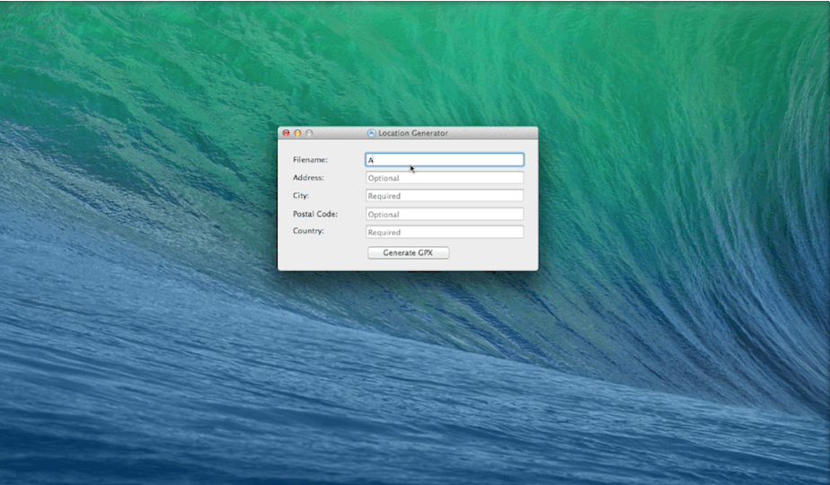

Location-Generator
==================

`Location-Generator` is an Mac OS app that allows you to easily create a GPX file without wasting time to do it through a browser.
Really useful when you would like to simulate a location with Xcode. What you need to do is just create the file then import it to your xcode project.

When it's done, the Finder will be open to the directory where the file is generated (~/Documents/GPX_Generator/)

Dependency
----------
This app use the script [GPX-Generator](https://github.com/StefanLage/GPX-Generator) to create a GPX file

 

**Enjoy !**